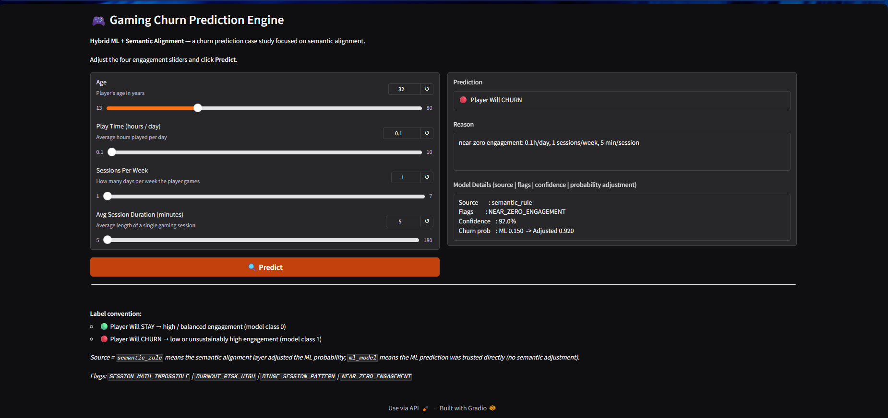
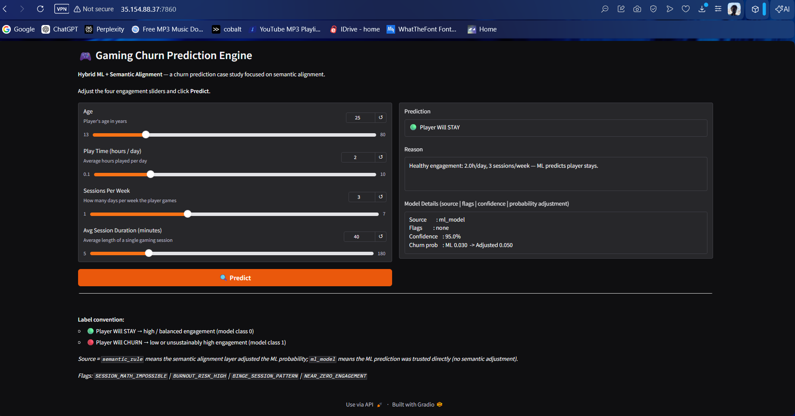
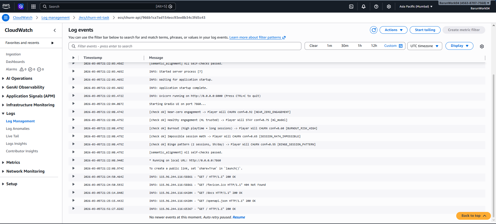
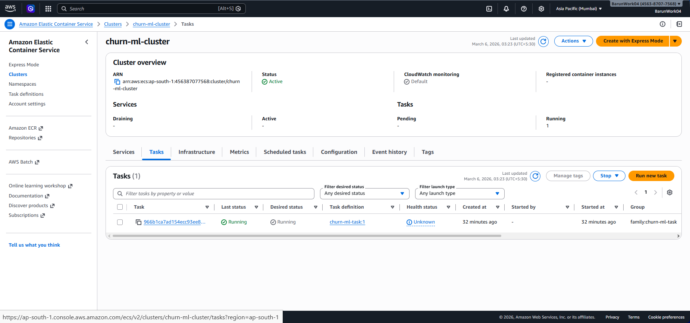

# Semantic Alignment in Churn Prediction (Case Study)

This project is a productionized case study that shows how to diagnose and correct
semantic misalignment in machine learning systems. The example domain is gaming churn,
but the framework generalizes across industries.

## ML Pipeline (End-to-End)

### Dataset and Features

- Dataset: [data/gaming_churn.csv](data/gaming_churn.csv)
- Behavioral + categorical features: engagement, session activity, and player profile
- Goal label: churn outcome from historical behavior

### Preprocessing and Feature Consistency

- Cleaning, encoding, and scaling to match training and inference behavior
- A stable feature order is persisted in [models/col_order.pkl](models/col_order.pkl)
- A fitted scaler is persisted in [models/scaler.pkl](models/scaler.pkl)

### Synthetic Data via GAN (Class Balance)

- A GAN-based balancing step is used to address class imbalance and improve coverage
- Synthetic samples increase representation of rare churn behaviors
- The model is validated on real data to avoid synthetic leakage

Why GAN?

- It preserves multivariate feature relationships better than naive oversampling
- It reduces bias toward the dominant class while retaining realistic patterns

### Model Training and Artifacts

- Model: RandomForest (trained offline and saved as [models/best_model.pkl](models/best_model.pkl))
- Inference logic: [backend/model/predict.py](backend/model/predict.py)
- Training and preprocessing notebooks: [notebooks/](notebooks)

## Semantic Misalignment (Core Research Focus)

Modern ML models often fail not because of weak algorithms, but because training labels
encode outcomes while stakeholders expect predictions about intent or future behavior.
This mismatch is semantic misalignment.

Semantic misalignment occurs when:

- Labels represent an observed outcome
- But the prediction task is interpreted as intent or risk

### Example (Gaming Churn)

- Label: player churned
- Reality: churn may represent burnout, lifecycle completion, or external factors
- Intent: identify players at risk of disengagement

The model learns what churn looked like in the past, not why a player is likely to leave next.

## Semantic Misalignment (Core Research Focus)

### Framework: Semantic Alignment (Reusable Across ML Systems)

Machine learning models often fail not because the algorithm is weak, but because **the training labels do not perfectly represent the real-world decision we care about**.

This project introduces a simple **4-step Semantic Alignment framework** to detect and correct this problem.

---

### 1. Identify Label Origin

Understand **how the dataset labels were created**.

**Ask:**  
*What real-world event produced this label?*

**Examples**
- **Churn model:** label = user deleted account after *N* days  
- **Fraud model:** label = fraud cases that were *caught*  
- **Medical model:** label = *diagnosed* disease cases  

These labels represent **observed events**, not necessarily the true underlying condition.

---

### 2. Identify Prediction Intent

Define **what the system actually needs to predict**.

**Ask:**  
*What decision does the user want help with?*

**Examples**
- Predict **disengagement risk** (not just account deletion)  
- Predict **fraud risk** (not only confirmed fraud)  
- Predict **health deterioration risk** (not just diagnosed illness)

---

### 3. Detect Semantic Mismatch

Check whether the model behaves **in ways that contradict real-world logic**.

**Common signals**
- Counter-intuitive predictions  
- Edge cases behaving backwards  
- Extremely confident outputs in obvious scenarios  

**Example (this project)**  
A player with **very high engagement being predicted to churn**.

This usually indicates **objective misalignment**, not overfitting.

---

### 4. Apply a Semantic Alignment Layer

Introduce a lightweight **alignment layer** between the ML output and the final prediction.

**Possible approaches**
- Logical rules  
- Constraints  
- Hybrid ML + rule systems  

**In this project**
- **Rules capture obvious real-world behavior**
- **ML handles complex interaction patterns**

This keeps the model flexible while preventing **clearly incorrect predictions**.

This project implements a hybrid alignment layer in
[backend/model/semantic_alignment.py](backend/model/semantic_alignment.py).

### Concrete Misalignment Examples (from this project)

- Burnout pattern: very high playtime + long sessions can indicate churn risk
- Impossible session math: weekly session demand exceeds available time
- Binge pattern: few sessions but very high daily playtime
- Near-zero engagement: minimal activity should override a confident stay prediction

## Generalization Beyond Gaming

Semantic alignment applies broadly:

- Credit scoring: label = defaulted, intent = risk
- Fraud detection: label = caught fraud, intent = fraud likelihood
- Medical ML: label = diagnosed disease, intent = early detection
- Recommenders: label = clicks, intent = satisfaction

Common pattern: labels describe what happened, not what will happen.

### Why Not Just Retrain the Model?

* **Not Cost-Efficient:** Retraining repeatedly increases compute and infrastructure costs without fixing the root issue.
* **Time-Consuming:** Each retraining cycle requires time for training, evaluation, and redeployment.
* **Intent–Label Misalignment Persists:** Even with new data, user intent may still not perfectly match the dataset labels, so the same semantic mismatch can remain.

## What This Project Contributes

- A practical method to detect semantic bias between labels and intent
- A hybrid alignment layer that preserves ML behavior while fixing edge cases
- A reusable framework demonstrated end-to-end in a real deployment

## System Overview

- ML inference: RandomForest model with preprocessing and scaling
- Semantic alignment: rule-based probability adjustments
- API: FastAPI inference service
- UI: Gradio interactive interface

## UI and API

- UI entry point: [backend/ui/app.py](backend/ui/app.py)
- API entry point: [backend/api/main.py](backend/api/main.py)

## Dockerization

- Lightweight container build using [Dockerfile](Dockerfile)
- [start.sh](start.sh) launches FastAPI and Gradio in one container

## Cloud Deployment (AWS)

- Containerized with Docker and deployed to Amazon ECS (Fargate)
- CloudWatch logs used for runtime visibility
- Public UI: http://35.154.88.37:7860
- Public API: http://35.154.88.37:8000

## Repository Structure

- backend/
	- api/           FastAPI service
	- ui/            Gradio UI
	- model/         Model loading and semantic alignment logic
- models/          Trained model artifacts
- data/            Training data (not used at runtime)
- notebooks/       Research notebooks (not used at runtime)
- reports/         Figures and outputs (not used at runtime)

## Quickstart (Local)

1) Create environment and install deps

	 pip install -r requirements.txt

2) Run API and UI

	 ./start.sh

3) Validate semantic alignment behavior

	 python validate.py

## Docker

Build:

	docker build -t churn-prediction .

Run:

	docker run -p 8000:8000 -p 7860:7860 --name churn-app churn-prediction

Endpoints:

- API health: http://localhost:8000/
- UI: http://localhost:7860/

## API Example

POST /predict

{
	"Age": 25,
	"PlayTimeHours": 2.0,
	"SessionsPerWeek": 4,
	"AvgSessionDurationMinutes": 45
}

## CI/CD

The CI workflow:

- Runs validation tests
- Performs an API smoke test

## Screenshots

## Key Challenges Faced During the Project

1. Model training and feature consistency
   The UI captures four engagement inputs, while the model expects a full feature set.
   Neutral defaults plus alignment logic were required to keep inference stable.

2. Semantic alignment behavior
   Raw ML predictions sometimes contradicted intuitive behavior (for example, high
   engagement flagged as churn), requiring explicit rule-based corrections.

3. Dockerization and dependencies
   Building a slim container that included the model, API, UI, and correct libraries
   required multiple iterations of dependency and layout fixes.

4. Networking and port exposure
   Gradio needed correct host binding and port exposure to be reachable externally.

5. AWS ECS deployment
   ECS setup involved VPC, subnet, and security group tuning plus public access config.

